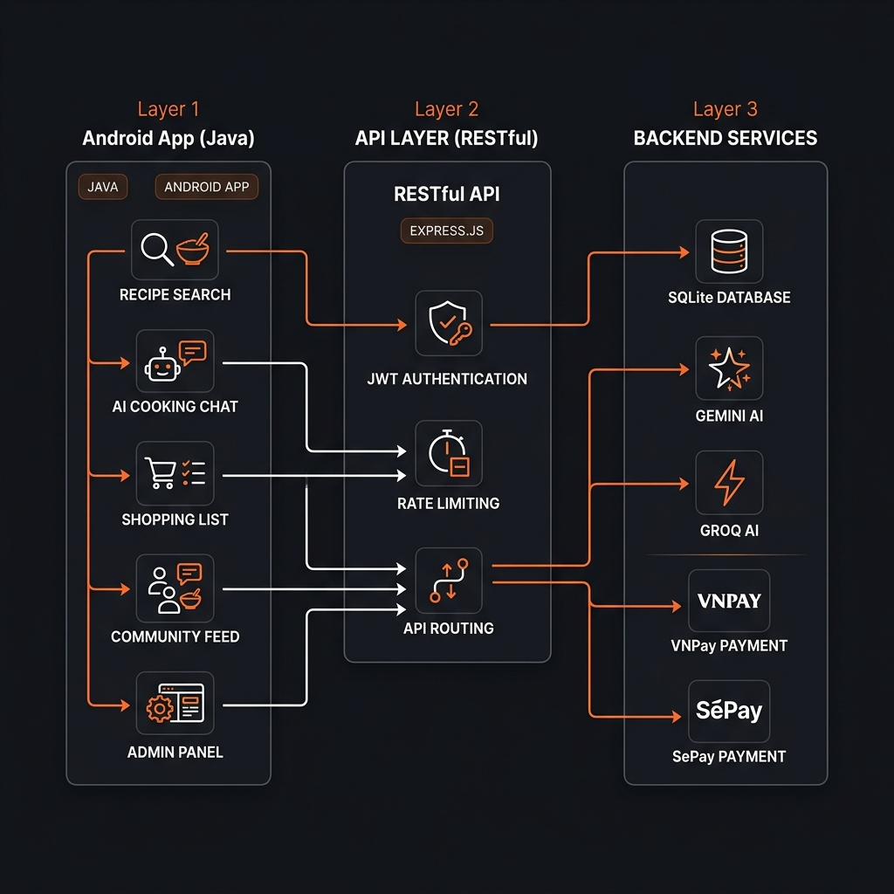
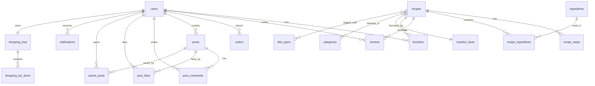

<p align="center">
  
</p>

<h1 align="center">🍳 CookApp — Ứng Dụng Nấu Ăn Thông Minh</h1>

<p align="center">
  
  
  
  
  
  
</p>

<p align="center">
  <b>Ứng dụng Android hỗ trợ nấu ăn với AI chatbot, video hướng dẫn, mua sắm nguyên liệu và cộng đồng chia sẻ công thức.</b>
</p>

---

## 📋 Mục Lục

- [Giới thiệu](#-giới-thiệu)
- [Kiến trúc hệ thống](#-kiến-trúc-hệ-thống)
- [Tính năng chính](#-tính-năng-chính)
- [Công nghệ sử dụng](#-công-nghệ-sử-dụng)
- [Cấu trúc dự án](#-cấu-trúc-dự-án)
- [Cơ sở dữ liệu](#-cơ-sở-dữ-liệu)
- [API Endpoints](#-api-endpoints)
- [Cài đặt & Chạy](#-cài-đặt--chạy)
- [Thành viên nhóm](#-thành-viên-nhóm)

---

## 🎯 Giới Thiệu

**CookApp** là ứng dụng Android hỗ trợ nấu ăn toàn diện, được phát triển như Bài tập lớn môn **Phát triển ứng dụng di động (MAD)** tại **Học viện Công nghệ Bưu chính Viễn thông**.

Ứng dụng cung cấp:
- 🍲 **12+ công thức nấu ăn** Việt Nam chi tiết với video hướng dẫn
- 🤖 **Chef AI** — Trợ lý nấu ăn thông minh sử dụng Gemini & Groq
- 🛒 **Mua sắm nguyên liệu** trực tuyến từ WinMart, Bách Hóa Xanh, Co.op Mart
- 💳 **Thanh toán** qua VNPay sandbox
- 👥 **Cộng đồng** chia sẻ mẹo nấu ăn

---

## 🏗 Kiến Trúc Hệ Thống

<p align="center">
  
</p>

```
┌─────────────────────┐     HTTPS/REST     ┌─────────────────────────┐
│   Android App       │ ◄═══════════════► │   Node.js Backend       │
│   (Java + Room)     │     JSON + JWT     │   (Express.js)          │
├─────────────────────┤                    ├─────────────────────────┤
│ • Retrofit (HTTP)   │                    │ • Sequelize ORM         │
│ • Room (Local DB)   │                    │ • JWT Authentication    │
│ • ExoPlayer (Video) │                    │ • Rate Limiting         │
│ • Glide (Images)    │                    │ • Helmet (Security)     │
│ • GPS Location      │                    │ • Multer (File Upload)  │
└─────────────────────┘                    ├─────────────────────────┤
                                           │ External Services:      │
                                           │ • Google Gemini AI      │
                                           │ • Groq AI (LLaMA)      │
                                           │ • VNPay Sandbox         │
                                           │ • SePay Gateway         │
                                           │ • SQLite Database       │
                                           └─────────────────────────┘
```

---

## ✨ Tính Năng Chính

### 📱 Ứng dụng Android

| # | Tính năng | Mô tả |
|---|-----------|-------|
| 1 | **Danh sách công thức** | Hiển thị 12+ món Việt Nam với ảnh, thời gian nấu, độ khó, calo |
| 2 | **Chi tiết công thức** | Nguyên liệu, bước nấu chi tiết, thông tin dinh dưỡng đầy đủ |
| 3 | **Video hướng dẫn** | Xem video nấu ăn với ExoPlayer, đồng bộ bước nấu theo thời gian |
| 4 | **Chế độ nấu (Cooking Mode)** | Hiển thị từng bước, hẹn giờ đếm ngược tự động, điều khiển video |
| 5 | **Tìm kiếm thông minh** | Tìm theo tên, nguyên liệu, lọc theo danh mục & chế độ ăn |
| 6 | **Smart Fridge** | Nhập nguyên liệu có sẵn → AI gợi ý công thức phù hợp |
| 7 | **Chef AI Chatbot** | Trợ lý nấu ăn AI hỏi đáp mọi câu hỏi ẩm thực |
| 8 | **Yêu thích** | Lưu công thức yêu thích, truy cập nhanh |
| 9 | **Đánh giá & nhận xét** | Chấm sao 1–5 và viết bình luận cho công thức |
| 10 | **Danh sách mua sắm** | Tự động tạo từ nguyên liệu công thức, đánh dấu đã mua |
| 11 | **Mua sắm online** | So sánh giá từ WinMart, Bách Hóa Xanh, Co.op Mart |
| 12 | **Giỏ hàng & đặt hàng** | Thêm sản phẩm, checkout, thanh toán VNPay |
| 13 | **Quản lý đơn hàng** | Theo dõi trạng thái: Chờ xác nhận → Đang giao → Hoàn thành |
| 14 | **Cộng đồng** | Đăng bài, bình luận, thích, lưu bài viết |
| 15 | **Thông báo** | Cập nhật đơn hàng, tương tác cộng đồng |
| 16 | **Hồ sơ cá nhân** | Quản lý tài khoản, đổi mật khẩu, avatar |

### 🖥 Trang Admin (Web)

| # | Tính năng | Mô tả |
|---|-----------|-------|
| 1 | **Dashboard** | Thống kê tổng quan: users, recipes, orders, revenue |
| 2 | **Quản lý công thức** | CRUD công thức, upload ảnh/video, chỉnh sửa bước nấu |
| 3 | **Quản lý người dùng** | Xem, khóa/mở tài khoản, phân quyền admin |
| 4 | **Quản lý đơn hàng** | Cập nhật trạng thái, xem chi tiết đơn |
| 5 | **Quản lý bài viết** | Duyệt, xóa bài viết cộng đồng |
| 6 | **Quản lý đánh giá** | Xem và quản lý reviews |

---

## 🔧 Công Nghệ Sử Dụng

### Android (Client)

| Công nghệ | Phiên bản | Mục đích |
|-----------|-----------|----------|
| Java | 17 | Ngôn ngữ chính |
| Android SDK | 36 (min 24) | Framework Android |
| Retrofit 2 | 2.9.0 | HTTP Client cho REST API |
| Room | 2.6.1 | Local SQLite ORM |
| ExoPlayer (Media3) | 1.3.1 | Phát video hướng dẫn nấu ăn |
| Glide | 4.16.0 | Tải và cache hình ảnh |
| Material Design 3 | Latest | Giao diện Material UI |
| Play Services Location | 21.2.0 | GPS tìm cửa hàng gần |

### Backend (Server)

| Công nghệ | Phiên bản | Mục đích |
|-----------|-----------|----------|
| Node.js | 18+ | Runtime JavaScript |
| Express.js | 4.18.2 | Web framework |
| Sequelize | 6.35.2 | ORM cho SQLite |
| SQLite3 | 5.1.7 | Cơ sở dữ liệu |
| JWT | 9.0.3 | Xác thực người dùng |
| bcryptjs | 3.0.3 | Mã hóa mật khẩu |
| Helmet | 8.1.0 | Bảo mật HTTP headers |
| express-rate-limit | 8.3.2 | Chống brute-force & spam |
| Multer | 2.1.1 | Upload file (ảnh, video) |
| Google Generative AI | 0.24.1 | Gemini AI chatbot |
| Groq SDK | 1.1.2 | Groq AI (LLaMA) |

---

## 📁 Cấu Trúc Dự Án

```
CookApp/
├── 📱 app/                          # Android Application
│   └── src/main/java/.../cookapp/
│       ├── MainActivity.java        # Màn hình chính
│       ├── RecipeListActivity.java   # Danh sách công thức
│       ├── RecipeDetailActivity.java # Chi tiết công thức
│       ├── CookingModeActivity.java  # Chế độ nấu ăn
│       ├── ChatActivity.java         # Chef AI Chatbot
│       ├── ShopActivity.java         # Mua sắm nguyên liệu
│       ├── CommunityActivity.java    # Cộng đồng
│       ├── CartActivity.java         # Giỏ hàng
│       ├── CheckoutActivity.java     # Thanh toán
│       ├── admin/                    # Admin panel (Android)
│       ├── api/                      # Retrofit API services
│       ├── data/                     # Room entities & DAOs
│       ├── repository/               # Repository pattern
│       └── utils/                    # Utilities (NetworkConfig...)
│
├── 🖥 CookAppBackend/               # Node.js Backend
│   ├── server.js                     # Entry point
│   ├── seed.js                       # Database seeder (12 recipes)
│   ├── config/
│   │   └── database.js               # Sequelize config
│   ├── middleware/
│   │   ├── auth.js                   # JWT authentication
│   │   ├── adminAuth.js              # Admin authorization
│   │   └── urlRewriter.js            # Dynamic URL rewriting
│   ├── models/                       # 22 Sequelize models
│   │   ├── User.js
│   │   ├── Recipe.js
│   │   ├── Order.js
│   │   └── ... (19 more)
│   ├── routes/
│   │   ├── auth.js                   # Login / Register
│   │   ├── recipes.js                # Recipes CRUD + search
│   │   ├── chat.js                   # AI Chatbot
│   │   ├── community.js              # Posts, comments, likes
│   │   ├── user.js                   # Profile, favorites, orders
│   │   ├── stores.js                 # Store products
│   │   ├── admin.js                  # Admin dashboard API
│   │   ├── vnpay.js                  # VNPay payment
│   │   └── payment.js               # SePay webhook
│   ├── public/
│   │   ├── admin/                    # Web admin panel (HTML/CSS/JS)
│   │   ├── images/                   # Recipe images
│   │   └── videos/                   # Cooking videos
│   └── scripts/
│       └── make-admin.js             # Tạo tài khoản admin
│
├── 📄 .gitignore
├── 📄 build.gradle                   # Root Gradle config
├── 📄 settings.gradle
└── 📄 README.md                      # ← Bạn đang ở đây
```

---

## 🗄 Cơ Sở Dữ Liệu

### Sơ đồ quan hệ (ER Diagram)



### Danh sách bảng (22 bảng)

| # | Bảng | Mô tả | Quan hệ chính |
|---|------|--------|---------------|
| 1 | `users` | Người dùng (email, password, role) | 1-N với orders, reviews, posts |
| 2 | `recipes` | Công thức nấu ăn | 1-N với steps, ingredients |
| 3 | `categories` | Danh mục (Gia đình, Chay, Đặc sản...) | M-N với recipes |
| 4 | `diet_types` | Chế độ ăn (Keto, Low-carb, Chay...) | M-N với recipes |
| 5 | `ingredients` | Từ điển nguyên liệu | M-N với recipes |
| 6 | `recipe_steps` | Bước nấu (instruction, timer, video_start) | N-1 với recipes |
| 7 | `recipe_ingredients` | Định lượng nguyên liệu mỗi công thức | Bảng trung gian |
| 8 | `recipe_categories` | Quan hệ M-N recipe ↔ category | Bảng trung gian |
| 9 | `recipe_diet_types` | Quan hệ M-N recipe ↔ diet_type | Bảng trung gian |
| 10 | `nutrition_facts` | Dinh dưỡng (calories, protein, fat...) | 1-1 với recipes |
| 11 | `reviews` | Đánh giá sao + bình luận | N-1 với recipes, users |
| 12 | `favorites` | Danh sách yêu thích | N-1 với recipes, users |
| 13 | `shopping_lists` | Header danh sách mua sắm | 1-1 với users |
| 14 | `shopping_list_items` | Mặt hàng mua sắm | N-1 với shopping_lists |
| 15 | `orders` | Đơn hàng (COD/VNPay) | N-1 với users |
| 16 | `store_products` | Sản phẩm từ siêu thị | Độc lập |
| 17 | `posts` | Bài viết cộng đồng | N-1 với users |
| 18 | `post_comments` | Bình luận bài viết | N-1 với posts, users |
| 19 | `post_likes` | Lượt thích bài viết | N-1 với posts, users |
| 20 | `saved_posts` | Bài viết đã lưu | N-1 với posts, users |
| 21 | `notifications` | Thông báo | N-1 với users |

---

## 🌐 API Endpoints

### 🔐 Authentication

| Method | Endpoint | Mô tả | Auth |
|--------|----------|--------|------|
| `POST` | `/api/auth/register` | Đăng ký tài khoản | ❌ |
| `POST` | `/api/auth/login` | Đăng nhập, nhận JWT | ❌ |
| `GET` | `/api/auth/me` | Lấy thông tin user hiện tại | ✅ |

### 🍳 Recipes

| Method | Endpoint | Mô tả | Auth |
|--------|----------|--------|------|
| `GET` | `/api/recipes` | Danh sách tất cả công thức | ❌ |
| `GET` | `/api/recipes/:id` | Chi tiết công thức + bước nấu + dinh dưỡng | ❌ |
| `GET` | `/api/categories` | Danh sách danh mục | ❌ |
| `GET` | `/api/recipes/category/:name` | Lọc công thức theo danh mục | ❌ |
| `GET` | `/api/recipes/search?q=...` | Tìm kiếm thông minh | ❌ |
| `GET` | `/api/recipes/:id/reviews` | Đánh giá của công thức | ❌ |
| `POST` | `/api/recipes/:id/reviews` | Gửi đánh giá | ✅ |

### 🤖 AI Chatbot

| Method | Endpoint | Mô tả | Auth |
|--------|----------|--------|------|
| `POST` | `/api/chat` | Gửi tin nhắn cho Chef AI | ✅ |
| `POST` | `/api/smart-fridge` | Gợi ý công thức từ nguyên liệu có sẵn | ✅ |
| `GET` | `/api/health` | Health check | ❌ |

### 👤 User

| Method | Endpoint | Mô tả | Auth |
|--------|----------|--------|------|
| `GET` | `/api/favorites` | Danh sách yêu thích | ✅ |
| `POST` | `/api/favorites/:recipeId` | Thêm/xóa yêu thích | ✅ |
| `GET` | `/api/shopping-list` | Danh sách mua sắm | ✅ |
| `POST` | `/api/shopping-list` | Thêm nguyên liệu vào list | ✅ |
| `GET` | `/api/orders` | Lịch sử đơn hàng | ✅ |
| `POST` | `/api/orders` | Tạo đơn hàng mới | ✅ |
| `GET` | `/api/notifications` | Danh sách thông báo | ✅ |
| `PUT` | `/api/profile` | Cập nhật hồ sơ | ✅ |

### 🛒 Shopping & Payment

| Method | Endpoint | Mô tả | Auth |
|--------|----------|--------|------|
| `GET` | `/api/store-products` | Sản phẩm từ siêu thị | ❌ |
| `POST` | `/api/payment/vnpay/create` | Tạo URL thanh toán VNPay | ✅ |
| `GET` | `/api/payment/vnpay/return` | VNPay callback | ❌ |
| `POST` | `/api/payment/webhook` | SePay webhook | ❌ |

### 👥 Community

| Method | Endpoint | Mô tả | Auth |
|--------|----------|--------|------|
| `GET` | `/api/community/posts` | Danh sách bài viết | ❌ |
| `POST` | `/api/community/posts` | Đăng bài mới | ✅ |
| `POST` | `/api/community/posts/:id/like` | Thích bài viết | ✅ |
| `POST` | `/api/community/posts/:id/comments` | Bình luận | ✅ |
| `POST` | `/api/community/posts/:id/save` | Lưu bài viết | ✅ |

### 🛡 Admin

| Method | Endpoint | Mô tả | Auth |
|--------|----------|--------|------|
| `GET` | `/api/admin/dashboard` | Thống kê tổng quan | ✅ Admin |
| `GET` | `/api/admin/users` | Quản lý người dùng | ✅ Admin |
| `PUT` | `/api/admin/orders/:id/status` | Cập nhật trạng thái đơn | ✅ Admin |
| `POST` | `/api/admin/recipes` | Thêm công thức mới | ✅ Admin |
| `DELETE` | `/api/admin/recipes/:id` | Xóa công thức | ✅ Admin |

---

## 🚀 Cài Đặt & Chạy

### Yêu cầu hệ thống

| Yêu cầu | Chi tiết |
|----------|---------|
| **Node.js** | v18 trở lên |
| **Android Studio** | Hedgehog trở lên |
| **Android SDK** | API Level 36 (min 24) |
| **JDK** | 17 |

### 1. Clone dự án

```bash
git clone https://github.com/NKTriS/CookApp-Project.git
cd CookApp-Project
```

### 2. Cài đặt Backend

```bash
cd CookAppBackend

# Cài dependencies
npm install

# Tạo file .env từ template
cp .env.example .env
# → Sửa file .env: thêm GEMINI_API_KEY, GROQ_API_KEY, VNPay keys...

# Nạp dữ liệu mẫu (12 công thức, 30 nguyên liệu, 40+ sản phẩm)
node seed.js

# Khởi chạy server
npm run dev
```

> **Server chạy tại:** `http://localhost:3000`
> **Admin Panel:** `http://localhost:3000/admin`

### 3. Cấu hình Android

1. Mở thư mục gốc bằng **Android Studio**
2. Sửa IP backend trong `app/.../utils/NetworkConfig.java`:
   ```java
   public static final String LAN_IP = "http://<YOUR_LOCAL_IP>:3000";
   ```
   > Thay `<YOUR_LOCAL_IP>` bằng IP LAN của máy (chạy `ipconfig` trên Windows)
3. **Build & Run** trên thiết bị/emulator

### 4. Tạo tài khoản Admin

```bash
cd CookAppBackend
node scripts/make-admin.js admin@cookapp.vn
```

---

## 🔐 Bảo Mật

| Biện pháp | Mô tả |
|-----------|-------|
| **JWT Authentication** | Token-based auth, hỗ trợ `Bearer` header |
| **bcrypt** | Mã hóa password với salt 10 rounds |
| **Helmet** | Bảo vệ HTTP headers (XSS, CSRF, Clickjacking...) |
| **Rate Limiting** | Auth: 10 req/15min · Chat: 30 req/min · API: 200 req/min |
| **Input Validation** | Kiểm tra email, password strength khi đăng ký |
| **SQL Injection** | Sử dụng Sequelize ORM (parameterized queries) |
| **Env Secrets** | API keys, JWT secret lưu trong `.env` (gitignore) |

---

## 📊 Dữ Liệu Mẫu

Chạy `node seed.js` sẽ tạo sẵn:

| Loại dữ liệu | Số lượng |
|--------------|----------|
| 👤 Demo Users | 2 |
| 📂 Danh mục | 8 (Gia đình, Chay, Đặc sản...) |
| 🏷 Chế độ ăn | 8 (Keto, Low-carb, Eat-clean...) |
| 🥘 Công thức | 12 (Phở, Bún bò, Gà xào sả ớt...) |
| 📝 Bước nấu | 65+ |
| 🥬 Nguyên liệu | 30 |
| 🔬 Dinh dưỡng | 12 bảng chi tiết |
| ⭐ Đánh giá | 20 reviews |
| 📰 Bài viết | 7 + 10 bình luận |
| 🛒 Sản phẩm siêu thị | 40+ (WinMart, Bách Hóa Xanh, Co.op Mart) |

---

## 👨‍💻 Thành Viên Nhóm & Phân Công Công Việc

### Danh sách thành viên

| STT | Họ và Tên | MSSV | Vai trò chính |
|-----|-----------|------|---------------|
| 1 | Nguyễn Khắc Trí | B22DCAT303 | **Trưởng nhóm** — Database, Backend, Video, Cooking Mode, Chef AI Chatbot, Admin Panel |
| 2 | Phạm Đức Quân | — | Công thức, Tìm kiếm, Lọc danh mục |
| 3 | Phạm Minh Tâm | — | Mua sắm, Dinh dưỡng, Tích hợp API |
| 4 | Lê Tiến Dương | — | Yêu thích, Đánh giá, Cộng đồng |

### Bảng phân công chi tiết (Bổ sung Chef AI & Admin Panel)

| STT | Tên chức năng | Nội dung chức năng | Người phụ trách | Nhiệm vụ chính |
|:---:|:---|:---|:---|:---|
| 1 | Cung cấp công thức nấu ăn | Hiển thị danh sách và chi tiết công thức nấu ăn | Phạm Đức Quân | Thiết kế dữ liệu công thức, màn hình danh sách và chi tiết món ăn |
| 2 | Video hướng dẫn | Video hướng dẫn từng bước nấu ăn | Nguyễn Khắc Trí | Tích hợp và quản lý video hướng dẫn (đồng bộ timeline) |
| 3 | Tính năng lập danh sách mua sắm | Tạo danh sách nguyên liệu cần mua | Phạm Minh Tâm | Xây dựng chức năng tạo, chỉnh sửa danh sách mua sắm |
| 4 | Tìm kiếm công thức | Tìm kiếm theo tên món, nguyên liệu, thời gian | Phạm Đức Quân | Thiết kế giao diện và xử lý logic tìm kiếm |
| 5 | Lọc công thức theo chế độ ăn uống | Lọc theo ăn kiêng, dị ứng | Phạm Đức Quân | Xử lý logic lọc và hiển thị kết quả |
| 6 | Chế độ xem công thức | Chế độ xem chi tiết các bước khi đang nấu ăn | Nguyễn Khắc Trí | Thiết kế giao diện Cooking Mode (dạng slide) |
| 7 | Lưu công thức yêu thích | Lưu và quản lý công thức yêu thích | Lê Tiến Dương | Xây dựng chức năng lưu, xóa, quản lý yêu thích |
| 8 | Chia sẻ công thức | Chia sẻ qua mạng xã hội hoặc email | Lê Tiến Dương | Tích hợp chức năng chia sẻ hệ thống |
| 9 | Góp ý và đánh giá công thức | Đánh giá sao và bình luận | Lê Tiến Dương | Xây dựng hệ thống đánh giá và góp ý |
| 10 | Tùy chỉnh công thức | Điều chỉnh nguyên liệu theo số người ăn | Phạm Minh Tâm | Xây dựng logic tính toán định lượng |
| 11 | Thông tin dinh dưỡng | Hiển thị calo và thành phần dinh dưỡng | Phạm Minh Tâm | Thiết kế dữ liệu và giao diện dinh dưỡng |
| 12 | Hẹn giờ nấu | Hẹn giờ cho từng bước nấu | Nguyễn Khắc Trí | Xây dựng chức năng hẹn giờ và thông báo rung/chuông |
| 13 | Cộng đồng người dùng | Diễn đàn thảo luận, chia sẻ kinh nghiệm | Lê Tiến Dương | Thiết kế diễn đàn, bài viết, bình luận |
| 14 | Tích hợp mua sắm | Liên kết dịch vụ giao hàng nguyên liệu | Phạm Minh Tâm | Tích hợp API dịch vụ mua sắm siêu thị |
| 15 | **Trợ lý ảo Chef AI** | Trò chuyện tư vấn ẩm thực & gợi ý món ăn | **Nguyễn Khắc Trí** | Xây dựng giao diện chat, tích hợp API Gemini & LLaMA-3.3, xử lý logic chatbot & Smart Fridge |
| 16 | **Quản trị (Admin Panel)** | Thống kê doanh thu, CRUD công thức, quản lý đơn hàng/người dùng/nội dung | **Nguyễn Khắc Trí** | Thiết kế giao diện Web Admin, API quản trị, tích hợp VNPay và xóa cascade bài đăng |

---

## 📄 License

Dự án này được phát triển cho mục đích học tập tại **PTIT**.

---

<p align="center">
  Made with ❤️ by <b>Nhóm 02 — D22AT-01</b> | PTIT 2026
</p>

# Cập nhật